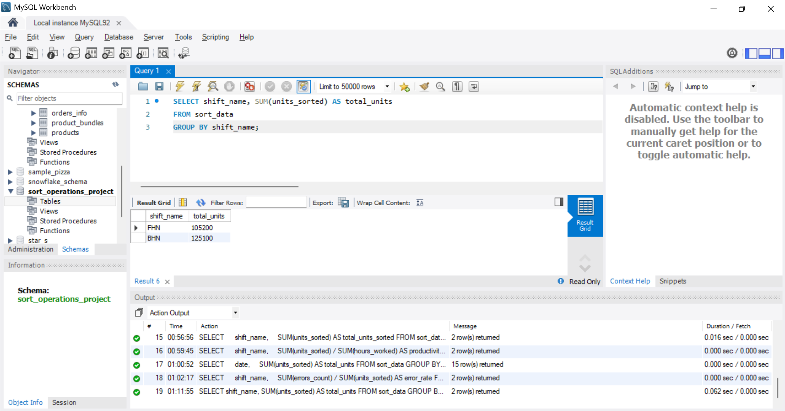
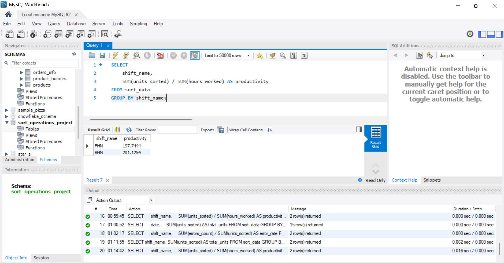
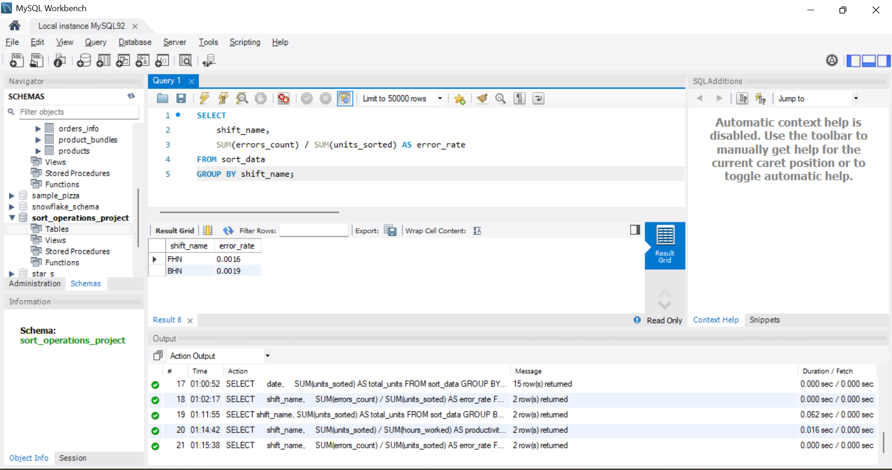
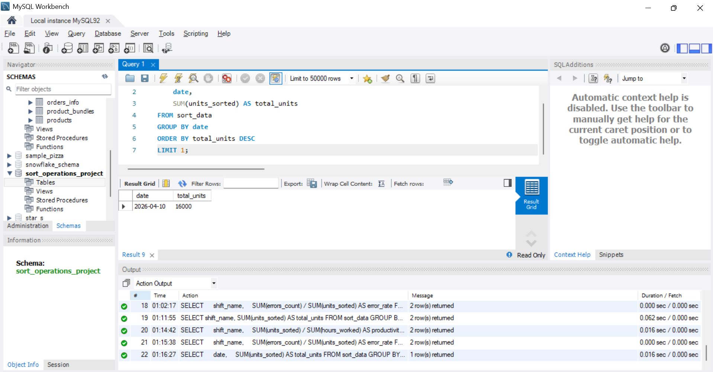

# sort-operations-sql-project

SQL project to analyze SORT department operations performance.

---

## 📊 Project Overview

This project analyzes SORT department performance using SQL.  
The dataset includes shift-level operational data such as headcount, units sorted, hours worked, and error counts.

---

## 🛠️ Tools Used

- MySQL Workbench
- SQL (Joins, Aggregations, Group By)
- Excel (Data preparation)
- GitHub (Project documentation)

---

## 📂 Dataset Columns

- date
- shift_name (FHN / BHN)
- headcount
- units_sorted
- hours_worked
- errors_count

---

## 📈 Key Insights

- BHN shift showed higher total output compared to FHN shift.
- Productivity differences identified between shifts.
- Peak performance days identified using daily aggregation.
- Error rate analysis used to evaluate quality.

---

## 📸 SQL Query Results

### 🔹 Total Units by Shift

---

### 🔹 Productivity by Shift

---

### 🔹 Error Rate by Shift

---

### 🔹 Top Performing Day

---

## 🧠 Business Impact

- Helps identify high-performing shifts
- Supports staffing optimization decisions
- Improves operational efficiency tracking
- Enables quality control monitoring

---

## 📌 Conclusion

This project demonstrates how SQL can be used to analyze real-world operational data and generate actionable insights.
